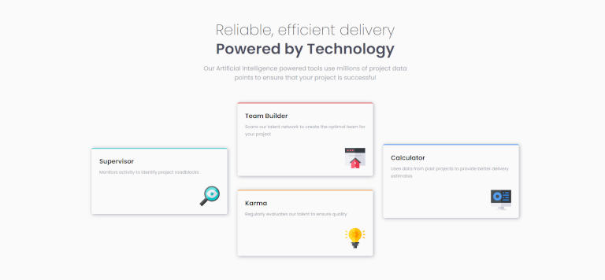

 # Frontend Mentor - Four card feature section

This is a solution to the [Four card feature section challenge on Frontend Mentor](https://www.frontendmentor.io/challenges/four-card-feature-section-weK1eFYK). Frontend Mentor challenges help you improve your coding skills by building realistic projects. 

### Screenshot

- Live Site URL: https://taavi80.github.io/Four-card-feature-section/

### Built with
- CSS custom properties
- CSS Grid

## Author
- Website - [taavi80](https://www.frontendmentor.io/profile/taavi80)